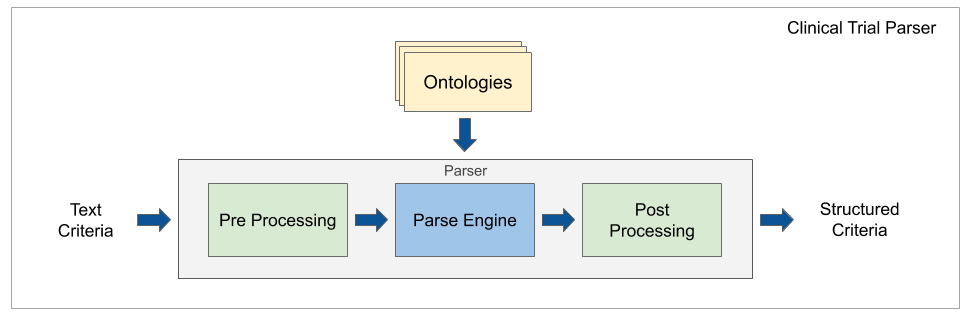
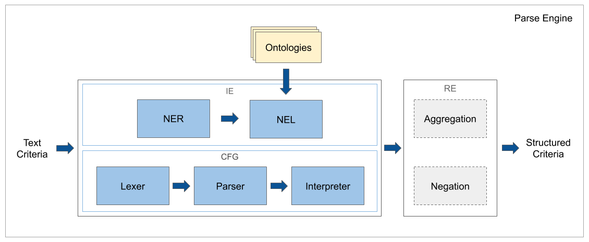
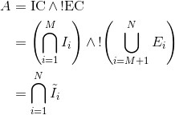

# Containerization of Clinical Trial Parser

- Splitting  .sh scripts into python/ go/ postgres
- Docker-compose to spin up a docker python/ go/ postgres
     - Issue: Installating pytext is resulting in fault segmentation bug (see developer guide)


# Clinical Trial Parser

This is a library for parsing clinical trial eligibility criteria. It contains context-free grammar (CFG) 
and information extraction (IE) parser models, annotated word labeling data, medical word embeddings and 
vocabulary tools.

## Table of contents

- [Motivation](#motivation)
- [Approach](#approach)
  - [Architecture](#architecture)
  - [Algorithm](#algorithm)
  - [Examples](#examples)
  - [Quality](#quality)
- [Requirements](#requirements)
- [Build](#build)
- [Parse](#parse)
- [Acknowledgement](#acknowledgement)
- [License](#license)
   
## Motivation

Clinical trials face multiple problems:

- Trials cannot recruit enough participants
- Diverse populations are not well represented
- It is hard to find relevant trials and few eligible patients enlist

Due to these challenges, research is often slower and more biased than it should be.

Clinical trials use eligibility criteria to specify the participant population and 
to guarantee patient safety. The difficulty is to convert criteria to a machine-readable format. 
This library aims to reduce the amount of manual work needed to understand clinical 
trial eligibility, by extracting information algorithmically and using domain intelligence 
from the text itself (embeddings) and external expert data (vocabularies/ontologies).

## Approach

### Architecture

Clinical Trial Parser relies on a combination of CFG and classic IE techniques to convert structured 
nominal, ordinal, and numerical requirements from eligibility criteria text. For details, 
see the [architecture description](doc/architecture.md).





### Algorithm

The purpose of this library is to interpret and convert eligibility criteria to machine-readable relations. 
This way trials can easily be searched and discovered by their eligibility requirements. 

To do this, inclusion (IC) and exclusion (EC) criteria sections are first extracted using regular expressions 
that identify the section headers. Next, the eligibility sections are split into individual criteria. 
Because the eligibility criteria must compute to one of the two values for each person – ‘eligible’ (yes) 
or ‘not eligible’ (no) – Boolean algebra can be used to express the eligibility logic. If an inclusion criterion 
is denoted by *I<sub>i</sub>* and an exclusion criterion by *E<sub>i</sub>*, the eligibility is computed as



where the effective inclusion criterion is defined as


A complete solution needs to consider a corner case where an exclusion criterion is actually an inclusion criterion. 
In this case, the negation cannot be applied. Fortunately, there are few such cases and they tend to affect 
only certain types of requirements.

The parser uses IE classifiers and CFG to convert individual eligibility criteria to machine-readable relations. 
Typically, both IE classifiers and CFG parsers are applied. Interpretations with confidence scores that are 
above a preset threshold are kept because a criterion may be a composite criterion built by joining multiple 
criteria together.

Variable is a convenient abstraction for interpreting eligibility criteria and defining machine-readable 
relations. It corresponds to a basic unit of clinical or demographic information that is extracted from 
a criterion and which determines a person’s eligibility.

### Examples

Extracted relations on variables are formatted with the following JSON fields:
- **id** of the parsed variable (either its MeSH ID or curated ID)
- **name** of the parsed variable
- **variableType** (can be `nominal`, `ordinal` or `numerical`)
- **value** of the nominal or ordinal variable that makes a person eligible for a trial
- **lower** is the lower limit of the numerical variable, which contains the limit value and Boolean to indicate whether the limit is inclusive or not
- **upper** is the upper limit of the numerical variable, which contains the value and Boolean to indicate whether the limit is inclusive or not
- **unit** of the numerical variable
- **score** is the confidence score between 0 and 1 of the parsed result being correct

The parser splits extraction by variable type. It handles 3 types of variables:

 - **Nominal requirements**: Requirements comprising a nominal variable (e.g. pregnant, leukemia, allergy) and a condition on the variable (i.e. does the study require or forbid the participant to have said variable). 
 These are the most common types of requirements. Examples:
      - The inclusion criterion for the clinical trial [NCT03442400](https://www.clinicaltrials.gov/ct2/show/record/NCT03442400), 
      \
      `All patients who have coronary stenoses between 40-70% severity and who have severe aortic stenosis undergoing TAVR work-up.` 
      \
      [would be](doc/TODO.md) parsed to 
      \
      `{"id":["C14.280.484.150","C14.280.955.249"],"name":"Aortic Valve Stenosis","value":["yes"],"variableType":"nominal","score":1}`
      
      - The inclusion criterion for the clinical trial [NCT04344015](https://www.clinicaltrials.gov/ct2/show/record/NCT04344015), 
      \
      `Prior diagnosis of COVID-19 documented by a laboratory test approved by the FDA`
      \
      [would be](doc/TODO.md) parsed to
      \
      `{"id":["C01.925"],"name":"COVID-19","value":["yes"],"variableType":"nominal","score":1}`

 - **Ordinal requirements**: Requirements comprising an ordinal variable (e.g. ECOG score, NYHA class) and a set of eligible values. Examples:
     
      - The exclusion criterion for the clinical trial [NCT03367871](https://www.clinicaltrials.gov/ct2/show/record/NCT03367871), 
      \
      `Patients with an ECOG performance status of 2, 3 or 4.` 
      \
      is parsed to 
      \
      `{"id":"100","name":"ecog","value":["0","1"],"variableType":"ordinal","score":1}`

 - **Numerical requirements**: Requirements comprising a numerical variable (e.g. age, BMI, platelet count) and an eligible range for the variable. Examples: 
 
      - The inclusion criterion for the clinical trial [NCT04272255](https://www.clinicaltrials.gov/ct2/show/record/NCT04272255), 
      \
      `Male or female, aged 18 to 59 (inclusive).`
      \
      is parsed to 
      \
      `{"id":"203","name":"age","lower":{"incl":true,"value":"18"},"upper":{"incl":true,"value":"59"},"variableType":"numerical","score":1}`
      
      - The inclusion criterion for the clinical trial [NCT04267796](https://www.clinicaltrials.gov/ct2/show/record/NCT04267796), 
      \
      `Self-reported height and weight indicating a BMI of at least 18.5 and < 25 kg/m^2` 
      \
      is parsed to 
      \
      `{"id":"203","name":"bmi","unit":"kg/m2","lower":{"incl":true,"value":"18.5"},"upper":{"incl":false,"value":"25"},"variableType":"numerical","score":1}`

      - The exclusion criterion for the clinical trial [NCT04257136](https://www.clinicaltrials.gov/ct2/show/record/NCT04257136),
      \
      `Absolute neutrophil count of < 1000 mm3`
      \
      is parsed to
      \
      `{"id":"408","name":"anc","unit":"cells/ul","lower":{"incl":true,"value":"1000"},"variableType":"numerical","score":1}`

### Quality

The quality of the parser is measured by randomly sampling eligibility criteria from recruiting trials. 
The CFG model is estimated to parse ordinal and numerical requirements with the precision of ≥ 90% and 
recall ≥ 85% per implemented variable. The IE model is estimated to parse nominal requirements with 
the precision of approximately 44% for heart-condition related criteria. Although the precision of 
NER is estimated to be ~ 88%, the grounding of extracted entity mentions to medical concepts lowers 
the IE quality, because the differences between the eligibility criteria and 
the [Medical Subject Headings](https://www.nlm.nih.gov/mesh/meshhome.html) (MeSH) vocabulary lead to 
imperfect NEL and because criteria are sometimes written ambiguously. The extracted concepts are grounded 
to about 6K medical variables.

## Requirements

This library works with Mac OS X or Linux. The [developer guide](doc/developer_guide.md) describes how to set up the project 
and prepare the resources.

- The CFG parser module requires [Go 1.11](https://golang.org/dl/) or higher

- The IE parser module requires [Python 3.7](https://www.python.org/) or higher, 
[PyText](https://pytext.readthedocs.io/en/master/index.html), 
[Natural Language Toolkit](https://www.nltk.org/index.html), 
and [Go 1.11](https://golang.org/dl/) or higher

- The word embedding module requires [Python 3.7](https://www.python.org/) or higher, 
the [fasttext](https://github.com/facebookresearch/fastText/tree/master/python) python module, 
and [Natural Language Toolkit](https://www.nltk.org/index.html)

- To download clinical trials from the [AACT database](https://aact.ctti-clinicaltrials.org/snapshots) using [`aact.sh`](script/aact.sh),
a [postgreSQL database](https://www.postgresql.org/download/) needs to be installed (version 11 or higher)

## Build

To build and test the CFG parser, run:
```
go build ./...
go test ./...
```

To train a new NER model, run:
```
pytext train < src/resources/config/ner.json
```

To test the NER model, run:
```
pytext test < src/resources/config/ner.json
```

## Parse 

The CFG parser can be run by executing:
```
./script/cfg_parse.sh
```

The sample input and output of the script are [`clinical_trials.csv`](data/input/clinical_trials.csv)
and [`cfg_parsed_clinical_trials.tsv`](data/output/cfg_parsed_clinical_trials.tsv).

The IE parser can be run by executing:
```
./script/ie_parse.sh
```

The sample input and output of the script are [`clinical_trials.csv`](data/input/clinical_trials.csv)
and [`ie_parsed_clinical_trials.csv`](data/output/ie_parsed_clinical_trials.csv).

## Acknowledgement

Thanks to the [Clinical Trials Transformation Initiative](https://www.ctti-clinicaltrials.org/)
(CTTI) for providing the [Aggregate Analysis of ClinicalTrials.gov](https://aact.ctti-clinicaltrials.org/)
(AACT) Database for the registered clinical studies at [ClinicalTrials.gov](https://clinicaltrials.gov/ct2/home).


## License

Clinical Trial Parser is Apache 2.0 licensed, as found in the [LICENSE file](LICENSE). 
Facebook assumes no responsibility for the resulting use of this library.


## GOROOT with scoop (windows)
$env:GOROOT = "C:\Users\username\scoop\apps\Go\version"