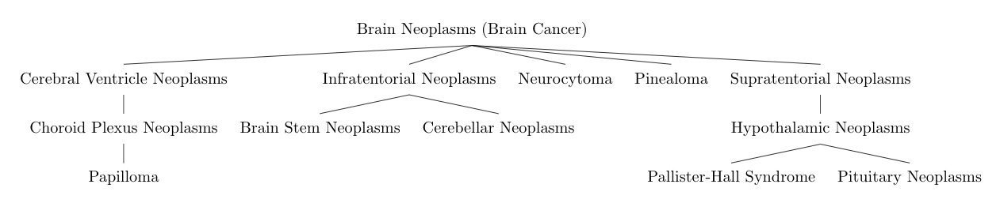
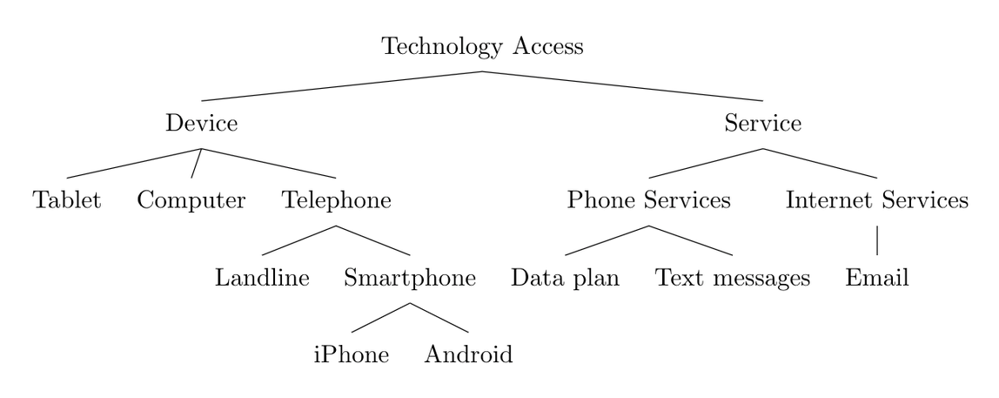

# Clinical Trial Parser Architecture

## Table of contents

- [General](#general)
- [Pre and Post Processing](#pre-and-post-processing)
  - [Preprocessing](#preprocessing)
  - [Post Processing](#post-processing)
- [CFG Architecture](#cfg-architecture)
  - [Lexer](#lexer)
  - [Parser](#parser)
  - [Interpreter](#interpreter)
- [IE Architecture](#ie-architecture)
  - [NER](#ner)
  - [NEL](#nel)
  - [Vocabularies](#vocabularies)
- [RE](#re)
  - [Negation](#negation)
  - [Aggregation](#aggregation)

## General

The parser splits extraction by variable type. It handles 3 types of variables:
 - **Nominal requirements**: Requirements comprising a nominal variable 
 (e.g., pregnant, leukemia, allergy) and a condition on the variable - i.e., does 
 the study require or forbid the participant to have that variable. 
 These are the most common types of requirements. Examples: "Cannot have heart disease", 
 "Can have a peanut allergy".
 - **Ordinal requirements**: Requirements comprising an ordinal variable 
 (e.g., ECOG score, NYHA score) and a set of eligible values. 
 Example: "ECOG score must be 0, 1, or 2".
 - **Numerical requirements**: Requirements comprising a numerical variable 
 (e.g., age, BMI, platelet count) and an eligible range for the variable. 
 Examples: "BMI < 40 kg/m2", "age must be ≥18 years and ≤ 35 years".

Nominal requirements are extracted with classical Information Extraction (IE) techniques:
- **Named entity recognition (NER)**: General NER extracts entities (people, places, things). 
The medical variable NER is trained to extract specific medical terms (e.g., diseases, medication, 
treatments).
- **Named entity linking (NEL)**: General NEL either grounds all references of the same entity 
to a specific entity in an ontology or creates an entity to represent something not yet in the ontology. 
The medical variable NEL links extracted terms to medical concepts (variables) from an ontology.
- **Ontology**: General ontologies are graphs composed of concepts and relationships. 
Our clinical trial ontology is a vocabulary of clinical concepts (e.g., diseases, medication, allergies), 
stored in a taxonomy structure and kept in a strict hierarchy as defined by 
the [Medical Subject Headings](https://www.nlm.nih.gov/mesh/meshhome.html) (MeSH) thesaurus.

Ordinal and numerical requirements are extracted via context-free grammar (CFG):
- **Lexer** splits a criterion into a sequence of tokens
- **Parser** takes a sequence of tokens as an input and uses grammar production rules to build parse trees
- **Interpreter** analyses the parse trees by removing duplicates and sub-trees

All requirement types should use:
- **Relation extraction (RE)**: General RE finds the relation between 2 extracted concepts 
(e.g., X is married to Y). The clinical trial RE finds the relation between trial criteria 
and extracted variables, or in other words, the RE determines the condition a trial requires 
for a specific variable (e.g., determining the difference between "must have heart disease" 
and "must not have heart diseases").

## Pre and Post Processing

### Preprocessing

The pipeline assumes that clinical trials are ingested from ClinicalTrials.gov. 
Once ingested, the eligibility criteria are extracted as text fields. Clinical trial 
eligibility criteria usually come in a semi-structured format that consist of inclusion 
criteria that a person must meet to participate and exclusion criteria that prevent 
a person from participating. Typical eligibility criteria encompass conditions on demographics, 
disease characteristics, current medical condition, prior treatments, and medical history.

After each line of text is labeled as either inclusive or exclusive, the requirements are 
normalized, masking numbers and punctuation in preparation for NER.

### Post Processing

The final step filters results by CFG and NER confidence levels and applies trial level logic 
to increase the quality of extracted requirements. For example, 2 pieces of trial-level logic 
could be applied:
- Any trials that require participants to consent to birth control should not also require participants to be pregnant.
- When possible, remove generalized requirements in favor of more specific requirements (e.g., remove 
a requirement for "cancer" if we also extracted a requirement for "brain cancer").

## CFG Architecture

### Lexer

The lexer splits a criterion into a sequence of tokens. A token is a substring of a criterion text 
with a value that specifies the type of the substring. Examples of token types include variable, unit, 
comparison and negation, and end-of-string. The unknown type is also included because criteria 
are frequently syntactically imperfect.

### Parser

The parser takes a sequence of tokens as an input and uses grammar production rules to build parse trees. 
The lexer tokens are the terminal nodes of the grammar production rules.

The parser uses the modified Cocke–Younger–Kasami (CYK) algorithm, which accepts grammar production rules 
that are in the binary normal form. The binary form ensures an efficient parsing algorithm. 
It keeps the production rules simple without requiring a non-terminal symbol to produce a single 
terminal symbol. A further simplification of production rules is achieved by modifying the CYK algorithm 
to do best-effort parsing so the root of a parse tree does not need to be the start symbol.

### Interpreter

The interpreter analyses the parse trees by removing duplicates and sub-trees. The remaining trees 
are evaluated to machine-readable structures, called relations.  

## IE Architecture

### NER

Medical variable NER uses a bidirectional LSTM slot labeling model with attention (BiLSTMSlotAttention) to extract medical terms 
in one of 13 labels: age, allergy, BMI, cancer, chronic disease, clinical variable (e.g., ECOG, platelet count), 
contraception consent, ethnicity, gender, language fluency, pregnancy, technology access, and treatment. 
It also extracts lower and upper bounds for scalar variables. The NER model is trained from 120K doubly-reviewed 
samples. Overall F1 of NER extraction is about 0.88.

### NEL

Medical variable NEL begins by normalizing the extracted variables by removing common non-significant words.
Normalized terms are directly linked to medical concepts from an ontology. This grounding of extracted terms 
to controlled medical concepts gives the medical variables and machine-readable nominal relations. 
This is useful because:

- Duplicate entities are removed
- Synonym entities are grounded to same concepts
- Grounded entities are given a hierarchy, which is useful when filtering on vague requirements 
in favor of more specific requirements (e.g., filter requirements for "cancer" in favor of requirements for "breast cancer")
- Grounded entities are linked to IDs, which are an industry standard and useful for interoperability

There are multiple ways to reference a medical concept. For example, some clinical trials use 
the terms "neoplasm", "tumor", and "cancer" interchangeably. Extracted terms may also include a variable 
number and type of qualifiers. Because of this a simple linking of extracted terms to concepts
may lead to a low recall. We experimented by projecting the cleaned and extracted terms into 
an embedding space and clustering the term vectors. The clustered terms can then be matched to 
additional medical concepts. This improved the NEL recall.

### Vocabularies

NEL currently uses the MeSH vocabulary to ground medical terms. As a data source, MeSH is useful for multiple reasons:
- The data are professionally audited and of high quality
- MeSH is annually updated
- It is hierarchically formatted
- It is a well accepted standard in the medical community

 |  |
 |:--:|
 | *MeSH Hierarchy for Brain Neoplasms (Brain Cancer)* |

However, MeSH also has its shortcomings. It is the NLM controlled vocabulary for indexing medical articles, 
not tailored for clinical trials. Review of NEL results shows that MeSH concepts are often too general 
for precise concept grounding and another vocabulary could lead for a better quality.

To meet the unique requirements of eligibility criteria parsing, MeSH is augmented with manually created concepts.
For example, clinical trials that require access or familiarity to specific technology usually only specify 
such technologies at a high level (e.g. smartphone or email). To create ontology entries at the specific 
level of detail needed for the parsing, we manually curated a vocabulary for the simplest domains 
(e.g., contraception consent, ethnicity, language fluency, pregnancy, technology access) and added synonyms to existing
MeSH concepts.
  
 |  |
 |:--:|
 | *Curated Hierarchy for Technology Access Requirements* |

## RE

The architecture design references relation extraction (RE), which we have demonstrated to be feasible 
but have [not yet included](TODO.md) in the parser implementation.

### Negation

Nominal requirements are worded in such a way as to either include or preclude participation 
depending on certain characteristics (e.g. "participants must be pregnant" vs "participants cannot be pregnant").
Negations can be detected using [NegEx](https://code.google.com/archive/p/negex/) or similar public algorithms.
Criteria are sometimes incorrectly formulated leading to logical paradoxes. 
For example, a study might list "not pregnant" as a requirement in both the inclusion and exclusion 
criteria sections. Readers must know the context and the common practice to determine that the study 
is actually simply asking for participants that are not pregnant.

### Aggregation

For the sake of extra clarity at the cost of being redundant, studies often stipulate the same 
requirement in multiple ways (i.e. a study might list "participants cannot be pregnant" in 
the inclusion section while also listing "participants who are pregnant" in the exclusion section). 
The IE may mistakenly interpret the same requirement twice. To remove contradictory requirements 
it is necessary to aggregate and deduplicate requirements on a trial level.
